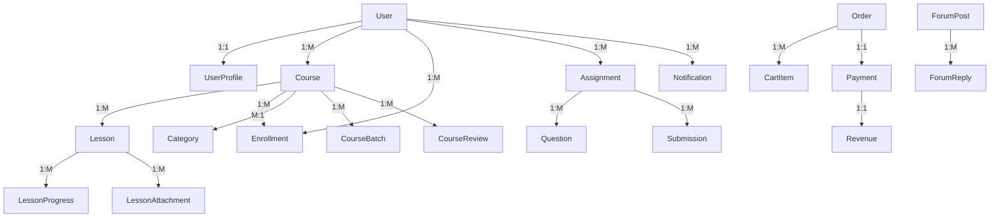

# Arsitektur Sistem - Hybrid LMS

## 📋 Daftar Isi

1. [Overview Arsitektur](#overview-arsitektur)
2. [Komponen Sistem](#komponen-sistem)
3. [Arsitektur Data](#arsitektur-data)
4. [API Architecture](#api-architecture)
5. [Security Architecture](#security-architecture)
6. [Scalability & Performance](#scalability--performance)
7. [Integration Architecture](#integration-architecture)

## 🏗️ Overview Arsitektur

Hybrid LMS menggunakan arsitektur **microservices modular** dengan Django REST Framework sebagai backbone. Sistem dirancang untuk mendukung dua model pembelajaran:

1. **Self-Paced Learning** (Model Udemy)
2. **Structured Classroom Learning** (Model Google Classroom)

### High-Level Architecture Diagram

```
┌─────────────────────────────────────────────────────────────┐
│                    CLIENT APPLICATIONS                      │
├─────────┬─────────┬─────────┬─────────┬─────────┬─────────┤
│   Web   │ Mobile  │ Desktop │   API   │ Partner │  Admin  │
│   App   │   App   │   App   │ Clients │   Apps  │ Dashboard│
└─────────┴─────────┴─────────┴─────────┴─────────┴─────────┘
                              │
┌─────────────────────────────────────────────────────────────┐
│                    API GATEWAY                              │
│  ┌─────────────┐ ┌─────────────┐ ┌─────────────┐           │
│  │    Auth     │ │    Rate     │ │  Request    │           │
│  │ Middleware  │ │  Limiting   │ │  Routing    │           │
│  └─────────────┘ └─────────────┘ └─────────────┘           │
└─────────────────────────────────────────────────────────────┘
                              │
┌─────────────────────────────────────────────────────────────┐
│                   CORE SERVICES                            │
├──────────┬──────────┬──────────┬──────────┬──────────┬─────┤
│   User   │ Course   │ Learning │ Payment  │Community │Admin│
│Management│Management│Experience│ System   │& Social  │ Mgmt│
│          │          │          │          │          │     │
│ • Auth   │• Courses │• Lessons │• Shopping│• Forums  │•Mods│
│ • Profile│• Category│• Progress│• Payment │• Reviews │•Anly│
│ • Roles  │• Reviews │• Assign. │• Revenue │• Notif.  │•Rept│
└──────────┴──────────┴──────────┴──────────┴──────────┴─────┘
                              │
┌─────────────────────────────────────────────────────────────┐
│                  SHARED SERVICES                           │
├──────────┬──────────┬──────────┬──────────┬──────────┬─────┤
│ Message  │ File     │ Email    │Analytics │Gamifica-│ Live│
│ Queue    │ Storage  │ Service  │& Report  │tion      │ Ses │
│ (Celery) │ (S3/FS)  │(SendGrid)│(Custom)  │(Badges)  │(Zoom│
│          │          │          │          │          │ /GM)│
└──────────┴──────────┴──────────┴──────────┴──────────┴─────┘
                              │
┌─────────────────────────────────────────────────────────────┐
│                   DATA LAYER                               │
├──────────┬──────────┬──────────┬──────────┬──────────┬─────┤
│PostgreSQL│  Redis   │ File     │ Log      │ External │ CDN │
│(Primary) │ (Cache/  │ System   │ Storage  │   APIs   │     │
│          │ Session) │ (Media)  │(ELK/Log) │(Stripe,  │     │
│          │          │          │          │ Email)   │     │
└──────────┴──────────┴──────────┴──────────┴──────────┴─────┘
```

## 🧩 Komponen Sistem

### 1. User Management Service (`accounts/`)

**Responsibilities:**

- User authentication & authorization
- Profile management
- Role-based access control (Student, Instructor, Admin)
- Email verification & password reset
- User activity tracking

**Key Models:**

- `User` - Extended Django user model
- `UserProfile` - Additional user information
- `EmailVerification` - Email verification tokens
- `UserActivity` - Activity logging

**API Endpoints:**

```
POST   /auth/register/      - User registration
POST   /auth/login/         - User login
POST   /auth/refresh/       - Token refresh
GET    /auth/profile/       - Get user profile
PUT    /auth/profile/       - Update profile
POST   /auth/verify-email/  - Email verification
POST   /auth/change-password/ - Change password
```

### 2. Course Management Service (`courses/`)

**Responsibilities:**

- Course creation & management
- Category management
- Course discovery & search
- Enrollment management
- Batch management (for structured courses)

**Key Models:**

- `Course` - Main course entity
- `Category` - Course categorization
- `CourseBatch` - Structured course batches
- `Enrollment` - Student enrollments
- `CourseReview` - Course reviews & ratings

**API Endpoints:**

```
GET    /courses/           - List courses
POST   /courses/           - Create course
GET    /courses/{id}/      - Course details
PUT    /courses/{id}/      - Update course
POST   /courses/{id}/enroll/ - Enroll in course
GET    /courses/categories/ - List categories
```

### 3. Learning Experience Service (`lessons/`)

**Responsibilities:**

- Lesson content management
- Progress tracking
- Video/media delivery
- Learning paths
- Completion certificates

**Key Models:**

- `Lesson` - Individual lesson content
- `LessonProgress` - Student progress tracking
- `LessonAttachment` - Lesson materials
- `Certificate` - Completion certificates

**API Endpoints:**

```
GET    /lessons/           - List lessons
POST   /lessons/           - Create lesson
GET    /lessons/{id}/      - Lesson details
POST   /lessons/{id}/complete/ - Mark complete
GET    /lessons/{id}/attachments/ - Get materials
```

### 4. Assessment Service (`assignments/`)

**Responsibilities:**

- Assignment creation & management
- Quiz system
- Submission handling
- Grading system
- Progress evaluation

**Key Models:**

- `Assignment` - Assignment definitions
- `Question` - Quiz questions
- `Submission` - Student submissions
- `Grade` - Grading records

### 5. Payment & E-commerce Service (`payments/`)

**Responsibilities:**

- Shopping cart management
- Payment processing
- Order management
- Revenue tracking
- Commission calculation

**Key Models:**

- `CartItem` - Shopping cart items
- `Order` - Purchase orders
- `Payment` - Payment records
- `Revenue` - Revenue distribution

### 6. Community & Social Service (`forums/`)

**Responsibilities:**

- Discussion forums
- Q&A system
- User interactions
- Content moderation
- Social features

**Key Models:**

- `Forum` - Forum categories
- `ForumPost` - Discussion posts
- `ForumReply` - Post replies
- `Like` - User interactions

### 7. Notification Service (`notifications/`)

**Responsibilities:**

- Real-time notifications
- Email notifications
- Push notifications
- Notification preferences
- Delivery tracking

**Key Models:**

- `Notification` - Notification records
- `NotificationPreference` - User preferences
- `EmailTemplate` - Email templates

## 📊 Arsitektur Data

### Database Schema Overview



### Data Storage Strategy

#### Primary Database (PostgreSQL)

- **Transactional data**: Users, courses, enrollments, payments
- **Content data**: Lessons, assignments, forum posts
- **Analytics data**: Progress, activity logs, revenue

#### Cache Layer (Redis)

- **Session storage**: User sessions
- **API response caching**: Course lists, user profiles
- **Real-time data**: Notification queues, live sessions
- **Rate limiting**: API throttling data

#### File Storage

- **Media files**: Course thumbnails, lesson videos, attachments
- **Static files**: CSS, JavaScript, images
- **Backups**: Database dumps, application backups

**Storage Options:**

```python
# Local Storage (Development)
MEDIA_ROOT = BASE_DIR / 'media'
STATIC_ROOT = BASE_DIR / 'staticfiles'

# AWS S3 (Production)
DEFAULT_FILE_STORAGE = 'storages.backends.s3boto3.S3Boto3Storage'
STATICFILES_STORAGE = 'storages.backends.s3boto3.StaticS3Boto3Storage'

# Google Cloud Storage (Alternative)
DEFAULT_FILE_STORAGE = 'storages.backends.gcloud.GoogleCloudStorage'
```

## 🔌 API Architecture

### RESTful API Design

#### Resource-Based URLs

```
/api/v1/courses/              - Course collection
/api/v1/courses/{id}/         - Specific course
/api/v1/courses/{id}/lessons/ - Course lessons
/api/v1/users/{id}/profile/   - User profile
```

#### HTTP Methods Mapping

- `GET` - Retrieve resource(s)
- `POST` - Create new resource
- `PUT` - Update entire resource
- `PATCH` - Partial resource update
- `DELETE` - Remove resource

#### Response Format Standardization

```json
{
  "success": true,
  "data": {
    "id": 1,
    "title": "Python Programming",
    "description": "Learn Python from scratch"
  },
  "meta": {
    "total": 150,
    "page": 1,
    "per_page": 20
  },
  "links": {
    "self": "/api/v1/courses/?page=1",
    "next": "/api/v1/courses/?page=2",
    "prev": null
  }
}
```

#### Error Response Format

```json
{
  "success": false,
  "error": {
    "code": "VALIDATION_ERROR",
    "message": "Invalid input data",
    "details": {
      "email": ["This field is required"],
      "password": ["Password too weak"]
    }
  },
  "meta": {
    "timestamp": "2024-01-15T10:30:00Z",
    "request_id": "req_abc123"
  }
}
```

### API Versioning Strategy

```python
# URL Versioning (Current)
urlpatterns = [
    path('api/v1/', include('api.v1.urls')),
    path('api/v2/', include('api.v2.urls')),  # Future
]

# Header Versioning (Alternative)
headers = {
    'Accept': 'application/vnd.hybridlms.v1+json'
}
```

### Authentication & Authorization

#### JWT Token Structure

```json
{
  "header": {
    "typ": "JWT",
    "alg": "HS256"
  },
  "payload": {
    "user_id": 123,
    "email": "user@example.com",
    "role": "student",
    "exp": 1640995200,
    "iat": 1640991600
  }
}
```

#### Permission Levels

```python
# Role-based permissions
class CoursePermission:
    CREATE = ['instructor', 'admin']
    READ = ['student', 'instructor', 'admin']
    UPDATE = ['owner', 'admin']
    DELETE = ['owner', 'admin']

# Object-level permissions
def has_course_permission(user, course, action):
    if action in ['create'] and user.role in ['instructor', 'admin']:
        return True
    if action in ['update', 'delete'] and (user == course.instructor or user.is_admin):
        return True
    return False
```

## 🔒 Security Architecture

### Authentication Security

#### Password Security

```python
# Strong password requirements
AUTH_PASSWORD_VALIDATORS = [
    {
        'NAME': 'django.contrib.auth.password_validation.UserAttributeSimilarityValidator',
    },
    {
        'NAME': 'django.contrib.auth.password_validation.MinimumLengthValidator',
        'OPTIONS': {
            'min_length': 8,
        }
    },
    {
        'NAME': 'django.contrib.auth.password_validation.CommonPasswordValidator',
    },
    {
        'NAME': 'django.contrib.auth.password_validation.NumericPasswordValidator',
    },
]

# Password hashing
PASSWORD_HASHERS = [
    'django.contrib.auth.hashers.Argon2PasswordHasher',
    'django.contrib.auth.hashers.PBKDF2PasswordHasher',
]
```

#### Session Security

```python
# Session configuration
SESSION_COOKIE_SECURE = True  # HTTPS only
SESSION_COOKIE_HTTPONLY = True  # No JavaScript access
SESSION_COOKIE_SAMESITE = 'Strict'  # CSRF protection
SESSION_EXPIRE_AT_BROWSER_CLOSE = False
SESSION_COOKIE_AGE = 86400  # 24 hours
```

### Data Security

#### Input Validation

```python
# Serializer validation
class CourseSerializer(serializers.ModelSerializer):
    title = serializers.CharField(max_length=200, validators=[validate_no_script])
    description = serializers.CharField(validators=[validate_html_content])
    price = serializers.DecimalField(max_digits=10, decimal_places=2, min_value=0)

    def validate_email(self, value):
        # Custom email validation
        if not re.match(r'^[a-zA-Z0-9._%+-]+@[a-zA-Z0-9.-]+\.[a-zA-Z]{2,}$', value):
            raise serializers.ValidationError("Invalid email format")
        return value
```

#### SQL Injection Prevention

```python
# Using Django ORM (parameterized queries)
Course.objects.filter(category__name=category_name)  # Safe

# Raw queries with parameterization
Course.objects.raw(
    "SELECT * FROM courses WHERE category = %s",
    [category_name]
)  # Safe

# Never do this:
# Course.objects.raw(f"SELECT * FROM courses WHERE category = '{category_name}'")  # Vulnerable
```

#### XSS Prevention

```python
# Template auto-escaping (enabled by default)
{{ course.title }}  # Automatically escaped

# Manual escaping when needed
from django.utils.html import escape
safe_title = escape(user_input)

# Content Security Policy
CSP_DEFAULT_SRC = ("'self'",)
CSP_SCRIPT_SRC = ("'self'", "'unsafe-inline'")
CSP_STYLE_SRC = ("'self'", "'unsafe-inline'")
```

### API Security

#### Rate Limiting

```python
# django-ratelimit implementation
from django_ratelimit.decorators import ratelimit

@ratelimit(key='ip', rate='5/m', method='POST')
def login_view(request):
    # Login logic
    pass

@ratelimit(key='user', rate='100/h', method='GET')
def api_view(request):
    # API logic
    pass
```

#### CORS Configuration

```python
CORS_ALLOWED_ORIGINS = [
    "https://app.hybridlms.com",
    "https://admin.hybridlms.com",
]

CORS_ALLOW_CREDENTIALS = True
CORS_ALLOWED_HEADERS = [
    'accept',
    'accept-encoding',
    'authorization',
    'content-type',
    'dnt',
    'origin',
    'user-agent',
    'x-csrftoken',
    'x-requested-with',
]
```

## 📈 Scalability & Performance

### Horizontal Scaling Strategy

#### Application Layer Scaling

```yaml
# Docker Swarm/Kubernetes deployment
services:
  web:
    image: hybridlms:latest
    replicas: 3
    deploy:
      resources:
        limits:
          cpus: "1.0"
          memory: 1G
        reservations:
          cpus: "0.5"
          memory: 512M
```

#### Database Scaling

```python
# Read/Write splitting
class DatabaseRouter:
    def db_for_read(self, model, **hints):
        return 'read_replica'

    def db_for_write(self, model, **hints):
        return 'primary'

DATABASE_ROUTERS = ['myapp.routers.DatabaseRouter']

DATABASES = {
    'default': {},  # Primary (write)
    'read_replica': {},  # Read replica
}
```

### Caching Strategy

#### Multi-Level Caching

```python
# Level 1: Application cache
@cache_page(60 * 15)  # 15 minutes
def course_list(request):
    return Course.objects.all()

# Level 2: Database query cache
courses = Course.objects.select_related('instructor', 'category').prefetch_related('reviews')

# Level 3: Template fragment cache


    <!-- Expensive sidebar content -->


# Level 4: CDN cache (Nginx/CloudFlare)
location /static/ {
    expires 30d;
    add_header Cache-Control "public, immutable";
}
```

#### Cache Invalidation

```python
# Signal-based cache invalidation
from django.db.models.signals import post_save
from django.core.cache import cache

@receiver(post_save, sender=Course)
def invalidate_course_cache(sender, instance, **kwargs):
    cache.delete(f'course_{instance.id}')
    cache.delete('course_list')
    cache.delete(f'instructor_courses_{instance.instructor.id}')
```

### Database Optimization

#### Query Optimization

```python
# Avoid N+1 queries
courses = Course.objects.select_related('instructor', 'category')\
                       .prefetch_related('reviews', 'lessons')

# Use annotations for aggregations
from django.db.models import Avg, Count
courses = Course.objects.annotate(
    avg_rating=Avg('reviews__rating'),
    lesson_count=Count('lessons'),
    review_count=Count('reviews')
)

# Database indexes
class Course(models.Model):
    title = models.CharField(max_length=200, db_index=True)

    class Meta:
        indexes = [
            models.Index(fields=['created_at', 'is_published']),
            models.Index(fields=['category', 'difficulty_level']),
        ]
```

#### Connection Pooling

```python
# Database connection pooling
DATABASES = {
    'default': {
        'ENGINE': 'django.db.backends.postgresql',
        'OPTIONS': {
            'MAX_CONNS': 20,
            'MIN_CONNS': 5,
        },
        'CONN_MAX_AGE': 3600,  # 1 hour
    }
}
```

### Async Processing

#### Background Tasks with Celery

```python
# celery.py
from celery import Celery

app = Celery('hybridlms')
app.config_from_object('django.conf:settings', namespace='CELERY')
app.autodiscover_tasks()

# tasks.py
@app.task
def send_enrollment_email(user_id, course_id):
    user = User.objects.get(id=user_id)
    course = Course.objects.get(id=course_id)

    send_mail(
        subject=f'Enrollment Confirmation: {course.title}',
        message=f'You have successfully enrolled in {course.title}',
        from_email='noreply@hybridlms.com',
        recipient_list=[user.email],
    )

@app.task
def process_video_upload(lesson_id):
    lesson = Lesson.objects.get(id=lesson_id)
    # Video processing logic
    process_video(lesson.video_file.path)
    lesson.is_processed = True
    lesson.save()
```

## 🔗 Integration Architecture

### Third-Party Integrations

#### Payment Gateway (Stripe)

```python
# payments/stripe_service.py
import stripe

class StripeService:
    def __init__(self):
        stripe.api_key = settings.STRIPE_SECRET_KEY

    def create_payment_intent(self, amount, currency='usd'):
        return stripe.PaymentIntent.create(
            amount=amount * 100,  # Convert to cents
            currency=currency,
            automatic_payment_methods={'enabled': True}
        )

    def handle_webhook(self, payload, sig_header):
        event = stripe.Webhook.construct_event(
            payload, sig_header, settings.STRIPE_WEBHOOK_SECRET
        )

        if event['type'] == 'payment_intent.succeeded':
            self.handle_successful_payment(event['data']['object'])
```

#### Email Service (SendGrid)

```python
# notifications/email_service.py
from sendgrid import SendGridAPIClient
from sendgrid.helpers.mail import Mail

class EmailService:
    def __init__(self):
        self.sg = SendGridAPIClient(api_key=settings.SENDGRID_API_KEY)

    def send_template_email(self, to_email, template_id, dynamic_data):
        message = Mail(
            from_email='noreply@hybridlms.com',
            to_emails=to_email
        )
        message.template_id = template_id
        message.dynamic_template_data = dynamic_data

        response = self.sg.send(message)
        return response
```

#### Video Conferencing (Zoom/Google Meet)

```python
# live_sessions/zoom_service.py
class ZoomService:
    def __init__(self):
        self.api_key = settings.ZOOM_API_KEY
        self.api_secret = settings.ZOOM_API_SECRET

    def create_meeting(self, topic, start_time, duration):
        # Zoom API integration
        meeting_data = {
            'topic': topic,
            'type': 2,  # Scheduled meeting
            'start_time': start_time.isoformat(),
            'duration': duration,
            'settings': {
                'host_video': True,
                'participant_video': True,
                'waiting_room': True
            }
        }

        response = self.make_api_request('POST', '/users/me/meetings', meeting_data)
        return response
```

### Event-Driven Architecture

#### Domain Events

```python
# events/course_events.py
from django.dispatch import Signal

course_created = Signal()
course_published = Signal()
student_enrolled = Signal()
lesson_completed = Signal()

# Event handlers
@receiver(student_enrolled)
def handle_student_enrollment(sender, student, course, **kwargs):
    # Send welcome email
    send_enrollment_email.delay(student.id, course.id)

    # Update analytics
    update_enrollment_analytics.delay(course.id)

    # Award points
    award_enrollment_points.delay(student.id)

@receiver(lesson_completed)
def handle_lesson_completion(sender, student, lesson, **kwargs):
    # Update progress
    update_course_progress.delay(student.id, lesson.course.id)

    # Check for course completion
    check_course_completion.delay(student.id, lesson.course.id)

    # Award badges
    check_learning_badges.delay(student.id)
```

### API Gateway Pattern

#### Request Flow

```
Client Request → API Gateway → Authentication → Rate Limiting → Routing → Service
```

#### Implementation with Django Middleware

```python
# middleware/api_gateway.py
class APIGatewayMiddleware:
    def __init__(self, get_response):
        self.get_response = get_response

    def __call__(self, request):
        # Pre-processing
        if request.path.startswith('/api/'):
            # Authentication check
            if not self.authenticate_request(request):
                return JsonResponse({'error': 'Unauthorized'}, status=401)

            # Rate limiting
            if not self.check_rate_limit(request):
                return JsonResponse({'error': 'Rate limit exceeded'}, status=429)

            # Request logging
            self.log_request(request)

        response = self.get_response(request)

        # Post-processing
        if request.path.startswith('/api/'):
            self.log_response(request, response)

        return response
```

---

**Arsitektur Hybrid LMS dirancang untuk:**

- ✅ **Skalabilitas** - Mendukung pertumbuhan pengguna dan konten
- ✅ **Keamanan** - Implementasi security best practices
- ✅ **Performa** - Optimasi untuk response time yang cepat
- ✅ **Maintainability** - Kode yang mudah dipelihara dan dikembangkan
- ✅ **Extensibility** - Mudah ditambahkan fitur baru
- ✅ **Reliability** - Sistem yang stabil dan fault-tolerant

Arsitektur ini memberikan fondasi yang kuat untuk platform pembelajaran yang dapat berkembang seiring dengan kebutuhan bisnis.
